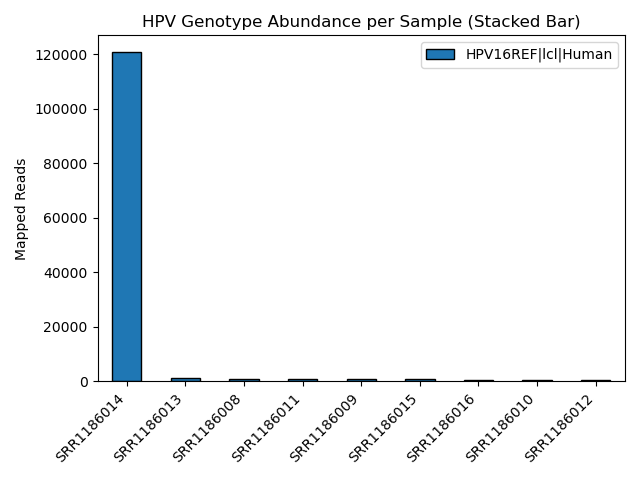

# HPV Amplicon Typing Pipeline (Demonstration)

This repository contains a demonstration pipeline for genotyping **Human Papillomavirus (HPV)** from Ion Torrent amplicon sequencing data. The pipeline aligns sequencing reads against a comprehensive HPV reference database and reports the mapped read counts, dominant HPV types per sample, and visual summaries via barplots and heatmaps.

---

## 📁 Project Structure

```
.
├── download_hpv_amplicons.sh       # SRA download + conversion script
├── hpv_downloads.slurm             # SLURM batch script to launch downloads
├── run_hpv_genotyping_pipeline.sh  # SLURM wrapper to run pipeline on Biowulf
├── scripts/
│   └── HPV_genotyping_pipeline_demo.py  # Main Python pipeline
├── References/
│   └── HPV_pave_Downloaded_06_28_2025.fa + Bowtie2 index files
├── hpv_typing_results/             # Output directory
└── SRR1186***/                    # Per-sample input FASTQ + SRA files
```

---

## ⚙️ Major Pipeline Functions

The core pipeline performs the following steps:

1. **Reference Indexing**

   * Build Bowtie2 index from `HPV_pave_Downloaded_06_28_2025.fa`

2. **Per-sample Processing**

   * `fastp` for read trimming and quality filtering
   * `bowtie2` alignment to HPV references
   * `samtools` BAM conversion, sorting, and indexing

3. **Genotyping Summary**

   * Extract mapped read counts per reference per sample
   * Generate:

     * `HPV_genotype_report.tsv` (full)
     * `HPV_genotype_report_condensed.tsv` (non-zero columns only)
     * `HPV_dominant_summary.tsv` (dominant type per sample)

4. **Visualization**

   * Stacked barplot of HPV types across samples
   * Heatmap of read counts per genotype

---

## 🚀 Quick Start (Biowulf)

```bash
sbatch hpv_downloads.slurm       # Download FASTQ from SRA
sbatch run_hpv_genotyping_pipeline.sh
```

This will populate `hpv_typing_results/` with summary tables and plots.

---

---

## 📦 Large Files Notice

To keep this repository lightweight and suitable for GitHub hosting, **large files such as FASTQ, BAM, and intermediate results are excluded** via `.gitignore`.

These files will either:

* ✅ Be **automatically downloaded** using `download_hpv_amplicons.sh`
* ✅ Be **generated by the pipeline** during processing
* ❌ **Not included** in the GitHub repo

If you clone this repo, make sure to run:

```bash
sbatch hpv_downloads.slurm              # Download SRA and convert to FASTQ
sbatch run_hpv_genotyping_pipeline.sh   # Run genotyping pipeline
```

This will reconstruct all necessary outputs in the `hpv_typing_results/` directory.

---

## 📆 Sample Outputs

* `HPV_genotype_report.tsv` – Full matrix of mapped reads per sample per genotype
* `HPV_genotype_report_condensed.tsv` – Filtered version without zero-only columns
* `HPV_dominant_summary.tsv` – Dominant HPV type per sample
* `HPV_genotype_barplot.png` – Stacked bar plot
* `HPV_genotype_heatmap.png` – Heatmap of read counts

---

## 📆 Example Data Used

The following SRA samples were used for demonstration:

```
SRR1186008 SRR1186009 SRR1186010 SRR1186011 SRR1186012
SRR1186013 SRR1186014 SRR1186015 SRR1186016
```

These are publicly available amplicon sequencing datasets.

---

## 📦 Requirements

* Python 3.10+
* `bowtie2`, `samtools`, `fastp`
* `matplotlib`, `seaborn`, `pandas`

Modules are automatically loaded in SLURM job wrappers.

---

## 💜 Reference

Reference genome downloaded from [PAVE](https://pave.niaid.nih.gov/search/search_database) on June 28, 2025, by selecting **all HPV genomes**, saved as:

```
References/HPV_pave_Downloaded_06_28_2025.fa
```

## 🚀 Running the Pipeline

Submit to Biowulf:

```bash
sbatch run_hpv_genotyping_pipeline.sh
```

Or run locally:

```bash
bash ./run_hpv_genotyping_pipeline.sh
```

## 📊 Example Output

**Dominant HPV Summary (HPV\_dominant\_summary.tsv):**

```
	Dominant_HPV_Type	Mapped_Reads
SRR1186008	HPV16REF|lcl|Human	1029
SRR1186009	HPV16REF|lcl|Human	1014
...
```

**Dominant HPV Summary (HPV\_dominant\_summary.tsv):**

```
	Dominant_HPV_Type	Mapped_Reads
SRR1186008	HPV16REF|lcl|Human	1029
SRR1186009	HPV16REF|lcl|Human	1014
...
```

**Genotype Report (condensed):**

```
	HPV16REF|lcl|Human	HPV18REF|lcl|Human
SRR1186008	1029	0
SRR1186009	1014	0
...
```


### 📊 Bar Plot:



### 🔥 Heatmap:


---

Developed by: **Patrick Xuechun Zhao, Ph.D.**
